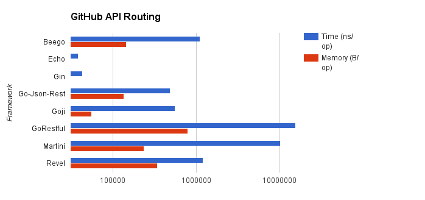
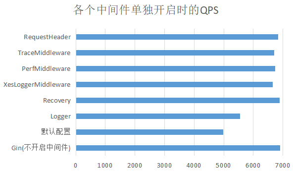

# Gaea
## Introduction
`Gaea` is a Gin-based web framework. In actual work, there are a series of additional engineering issues that need to be resolved before the project is applied to the production environment.
Otherwise, the portability of the system will be poor, and developers will not be able to focus on business development.
Incorporated into a complete set of solutions: dependency management, configuration management, compilation and deployment, monitoring & alarms, and support for one-click quick construction of web applications. If you are considering writing a web server in Golang, then Gaea is undoubtedly your best choice!

## Quick Start
### Notice
You need to replace the name in the project, such as `gaea` => `your app name`

```golang
//Recommended  $GOPATH/src  as your workspace
$ cd $GOPATH/src/

//clone the framework to local
$ git clone git@github.com:tal-tech/gaea.git
```

### Build & Run
The following is a simple example, detailed [Documentation](https://github.com/tal-tech/gaea-doc/blob/master/SUMMARY.md)

```golang
//Will use makefile to compile and generate binary files to the bin directory
$ cd gaea
$ make
$ ./bin/gaea
2020/08/26 14:40:02 CONF INIT,path:../conf/conf.ini
[GIN-debug] [WARNING] Running in "debug" mode. Switch to "release" mode in production.
 - using env:	export GIN_MODE=release
 - using code:	gin.SetMode(gin.ReleaseMode)

[GIN-debug] GET    /demo/test                --> gaea/app/controller/democontroller.GaeaDemo (1 handlers)
2020/08/26 14:40:02 [overseer master] run
2020/08/26 14:40:02 [overseer master] starting /mnt/d/codes/go/src/gaea/bin/gaea
2020/08/26 14:40:02 CONF INIT,path:../conf/conf.ini
[GIN-debug] [WARNING] Running in "debug" mode. Switch to "release" mode in production.
 - using env:	export GIN_MODE=release
 - using code:	gin.SetMode(gin.ReleaseMode)

[GIN-debug] GET    /demo/test                --> gaea/app/controller/democontroller.GaeaDemo (1 handlers)
2020/08/26 14:40:02 [overseer slave#1] run
2020/08/26 14:40:02 [overseer slave#1] start program
2020/08/26 14:40:09 [overseer master] proxy signal (window changed)

```

## Comparison of routing performance of major mainstream frameworks



(Picture to Resource Network)

#### Gaea Benchmark
Compared with the native Gin, the point that the Gaea framework affects performance is actually all concentrated on the middleware, because every http request will be run again, so observe the impact on the overall performance when each middle is turned on
##### Environment

| Metrics |  Remarks |
| ---- | ---- |
| SyesTem |  vm centos7 |
| Mem| 1GB |
|CPU| 1|
|Request number| 100000|
|Concurrent number |100|
|Data|{"code":0,"data":"hell world","msg":"ok","stat":1}|
 
 


We can clearly see from the figure:
* Gaea's default configuration will bring a certain amount of energy consumption, about 30%
* Among them, the `Logger` middleware has the largest impact on the performance of each middleware, and other middleware is almost negligible

*Note: The middleware in the test is used for testing and not open source*

In actual project applications, when [Log](https://github.com/tal-tech/loggerX) middleware is the bottleneck, we can close it or adjust the log level to `WARNING`